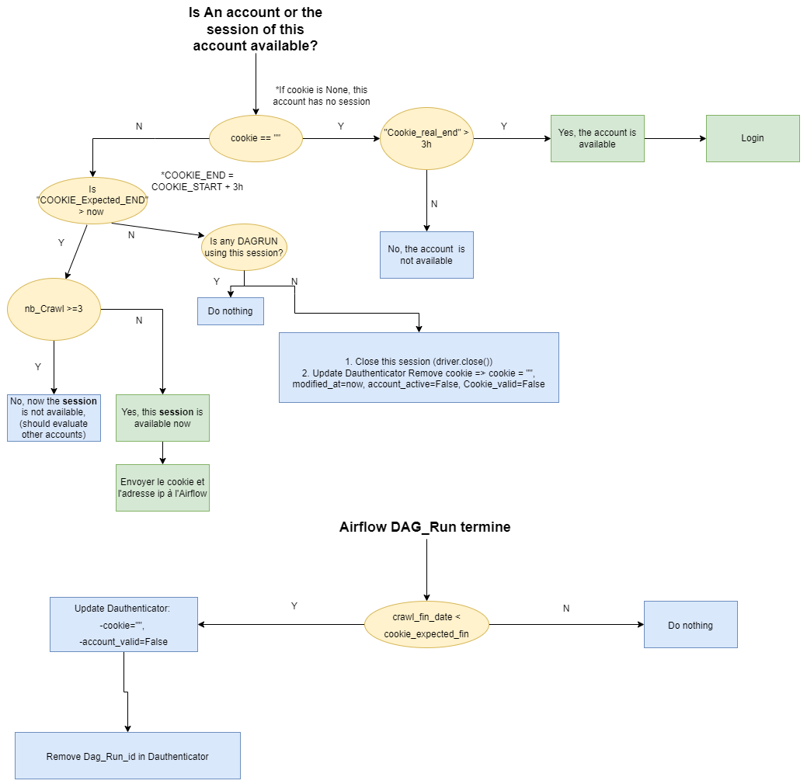
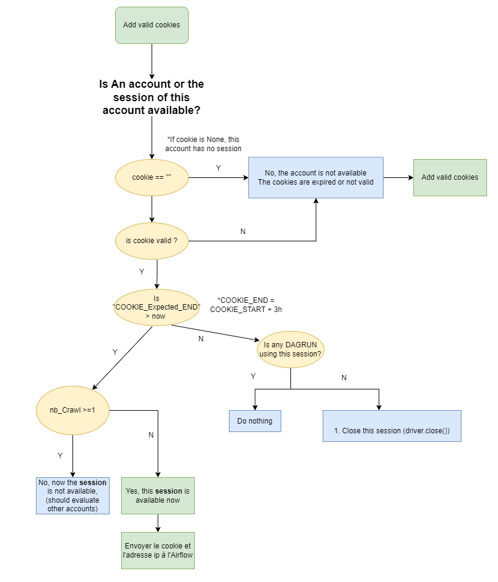

# Dauthentificator
Powered by _**Kaisensdata**_. Dauthenticator is a dajgo app that manage the driver's accounts 


## Strategies
**Stratégy 1 :**

login and get cookies



**Stratégy 2 :** 

Add cookies manually for the first time and never use login. There is a periodic task for upfating the cookies.



## Drivers

 - [ ] Twitter 
 - [ ] Instagram
 - [ ] Facebook
 - [ ] Quora
 - [ ] Adoasis
 - [ ] Tumblr
## Technology and Tools: 

- Docker 
- Postgres


## Usage
1. ###### Clone project
```bash
    $ git clone http://gitlab.kaisens.fr/kaisensdata/apps/4inshield/back/dauthenticator.git

    $ git checkout staging

```

2. ###### Before start the project :
```bash
    $ cd dauthenticator/dauthenticator/

    $ mkdir logs

    $ chmod 777 -R .

    $ docker-compose up -d --build
```

3. ###### Request and add the .env file

 - [ ] Change the BUILD_ENVIRONMENT to staging if you want to use the prod environment


4. ###### Start the project :
```bash
    $ cd ..
    $ docker-compose up -d --build
```

5. ###### Create super user:
```bash
    $ docker exec -it dauthenticator_local_server python manage.py createsuperuser
   
```

## Documentation:

## License:
This software is supplied to you by Kaisens data.
Any person who copy or redistribute this software
outside Kaisens data or attempts to do so could be
sued for intellectual property theft and corporate
rules violation.
