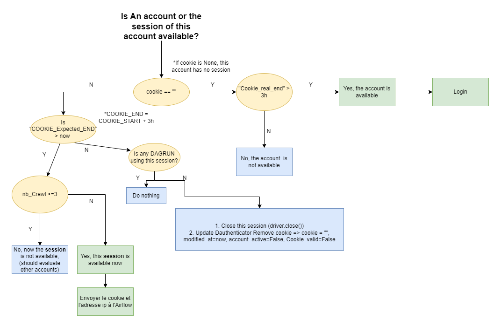
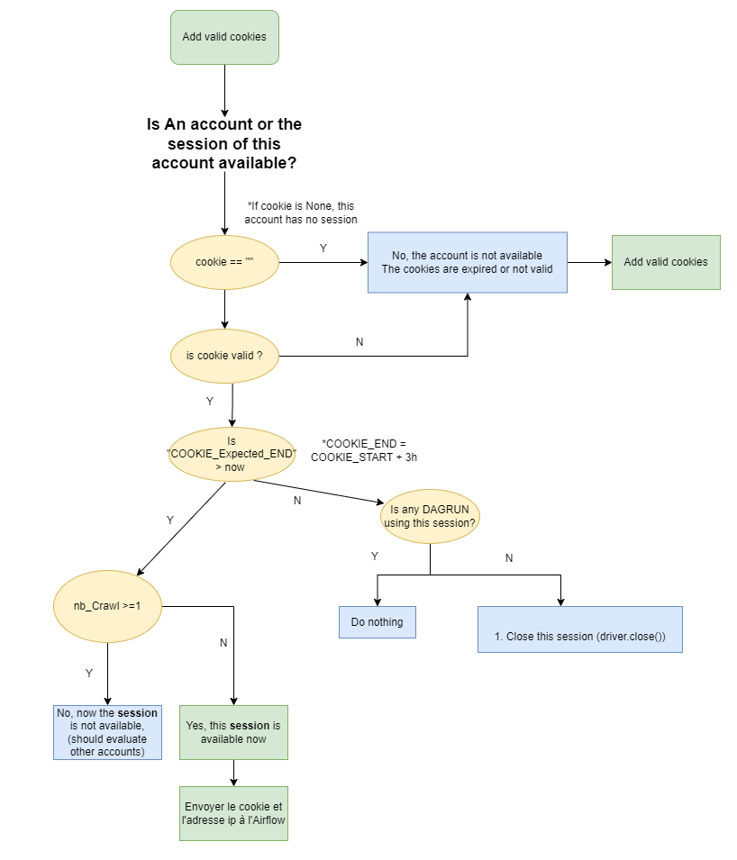

To manage the accounts and reduce the risk of being blocked by the platform when doing crawling activities, Dauthenticator uses the strategy of 3 hours crawling and 3 hours resting. So, we can use an account for period of 3 hours to do the different crawling tasks and then we should put it to rest for other 3 hours.

There are 2 types of strategy to determine the availability of an accounts:

**Strategy1:**

To check if an account is available or not using the first strategy you should start by checking if the cookie value in the database is empty or not:

1. if cookie is empty: it means that there is no running sessions using this account. So,
first, you need to calculate the difference between the datetime now and the cookies_real_end. If the difference is greater than 3 hours it means that the account completed 3 hours of rest and it's available so you can log in. Otherwise, it means that the account is in rest and you should wait until 3 hours of rest are reached.
2. if cookie are not empty: you should check if the datetime now is greater than the cookie_expected_end.  
If cookie_expected_end greater than now, you need to check how many sessions are in the dagrun table relative to this account. If the number of sessions is equal or greater than 3, it means that there is no available account, the max number of simultanious sessions is reached. Otherwise, it means that the account is available. 
Now, if the cookie_expected_end is lower than the datetime now, it means that you have already used the 3 hours reserved to crawl and you need to check if there is any running sessions. If there is a session in the dagrun you should do nothing. Otherwise, you should put the account in rest. That means you should update the cookie value to empty string and account_valid to False.

**Strategy2:**

Befor checking if an account is available or not, make sure that you added a valid cookie in the database.  
To check if an account is available or not using the second strategy you should start by adding a valid cookie

1. if cookie is empty: it means that the account is not available and you can't use it unless you add a valid cookies in the database relative to this account. 
2. if cookie are not empty: you should check if the cookie are valid or not. If the cookies are not valid so it means the account is not available and you should update the value of the cookie to empty. Otherwise, you need to check if the datetime now is greater than the cookie_expected_end.  
If cookie_expected_end greater than now, you need to verify if there is a running session of this account in the dagrun table. If there is a session, it means that there is no available account, the max number of simultanious sessions is reached. Otherwise, it means that the account is available. 
Now, if the cookie_expected_end is lower than the datetime now, it means that you have already used the 3 hours reserved to crawl and you need to check if there is a running session. If there is a session in the dagrun you should do nothing. Otherwise, you should put the account in rest and unlike the stragegy1 don't update the cookie value to empty

**Rules:**

To avoid account suspension/blocking:

* We should not change the ip for the same account 
* We should for each media distrubute the accounts in different Network (not all the account in the same ip)
* We should not use login for facebook and instagram